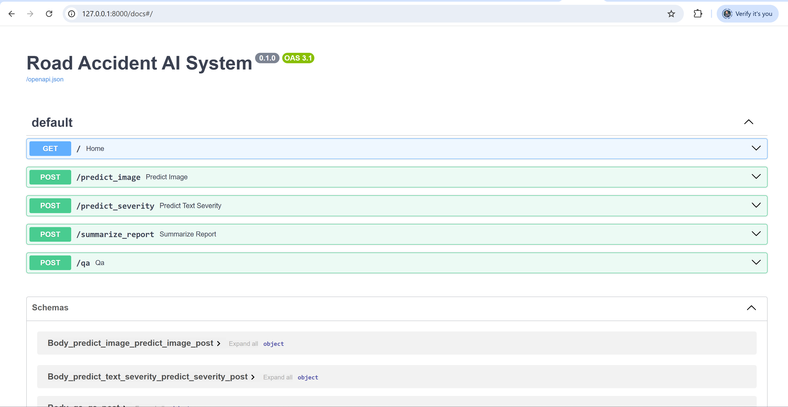

Step 1: Setup Environment
pip install fastapi uvicorn transformers torch torchvision pillow sentencepiece datasets spacy opencv-python pandas python-multipart
python -m spacy download en_core_web_sm

Step 2: Directory Structure
road_accident_ai/
├─ app/
│  ├─ main.py
│  ├─ models.py
│  ├─ utils.py
├─ data/
│  ├─ images/
│  └─ accident_reports.csv
├─ requirements.txt
└─ README.md

Step 3: Add the codes.

Step 4: Run Locally
uvicorn app.main:app --reload

Step 5:
Test:
Go to http://127.0.0.1:8000/docs
Test /predict_image, /predict_severity, /summarize_report, /qa endpoints

